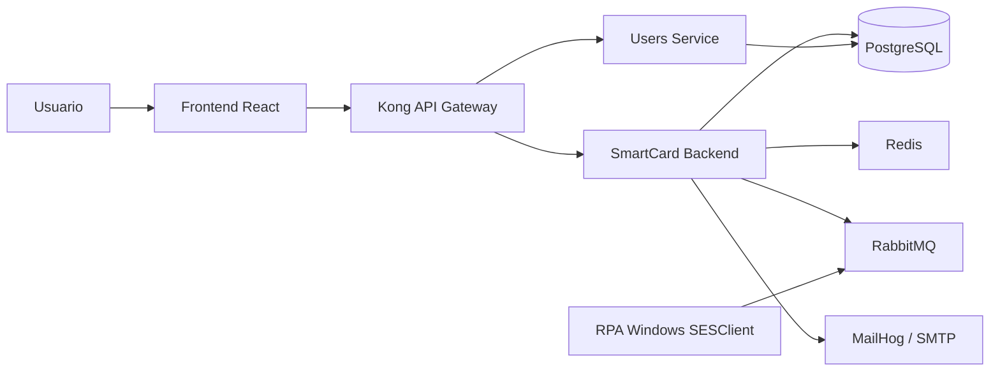

 # Lab Access

Sistema web para controle, consulta e acompanhamento de acessos ao laboratorio. A aplicacao permite enviar arquivos de registros, consultar acessos recentes ou por periodo, visualizar relatorios e graficos e acompanhar o processamento das buscas feitas automaticamente pelo RPA.

O projeto e organizado como uma arquitetura distribuida:



## Funcionalidades

- Autenticacao e autorizacao de usuarios com JWT.
- Cadastro e gerenciamento de usuarios e perfis.
- Upload e processamento de arquivos `.xls` e `.csv`.
- Consulta de registros dos ultimos cinco minutos ou por intervalo de data e hora.
- Integracao com o SESClient para extracao automatizada de registros de acesso.
- Atualizacao do status das buscas em tempo real por Server-Sent Events (SSE).
- Relatorios de ultimos acessos, acessos indevidos e status de usuarios.
- Graficos de acessos anuais e usuarios mais ativos.
- Notificacoes por e-mail em ambiente local usando MailHog.

## Tecnologias utilizadas

### Frontend

- **React 19** para a interface web.
- **TypeScript** para tipagem estatica.
- **Vite** para desenvolvimento e build.
- **React Router** para rotas da aplicacao.
- **Bootstrap** e classes utilitarias para layout e componentes visuais.
- **Chakra UI** e **Material UI** disponiveis para componentes de interface.
- **Chart.js** e **react-chartjs-2** para graficos.
- **Framer Motion** para animacoes.
- **React Loader Spinner** para indicadores de carregamento.
- **React Toastify** e **SweetAlert2** para mensagens e alertas.
- **fetch-event-source** para consumo de eventos SSE.
- **jwt-decode** para leitura de informacoes do token JWT.
- **ESLint** para analise e padronizacao do codigo.
- **Nginx** para servir os arquivos estaticos em producao.

### Backends

- **Python 3.12**.
- **Django 5.2** como framework web.
- **Django REST Framework 3.16** para APIs REST.
- **django-cors-headers** para configuracao de CORS.
- **django-htmx** para integracoes HTMX existentes.
- **django-allauth** para recursos de autenticacao.
- **Simple JWT**, **PyJWT** e `djangorestframework-simplejwt` para autenticacao baseada em tokens.
- **djangorestframework-api-key** para autenticacao por chave de API.
- **PostgreSQL** com `psycopg2-binary` como banco de dados relacional.
- **django-redis** e **redis-py** para comunicacao com Redis.
- **Celery** para tarefas assincronas.
- **django-celery-beat** para tarefas agendadas.
- **django-celery-results** para armazenamento de resultados de tarefas.
- **Pika** para comunicacao AMQP com RabbitMQ.
- **Pandas**, **OpenPyXL** e **xlrd** para leitura e processamento de planilhas.
- **FuzzyWuzzy**, **TheFuzz**, **RapidFuzz** e **python-Levenshtein** para comparacoes aproximadas de texto.
- **Faker** e **factory_boy** para dados e testes.
- **python-dotenv** e **python-decouple** para configuracoes por ambiente.

### RPA para Windows

- **Python** para a automacao.
- **PyAutoGUI** para controlar teclado, mouse e janelas do SESClient.
- **PyGetWindow**, **PyScreeze**, **PyMsgBox**, **MouseInfo**, **PyRect** e **PyTweening** como bibliotecas auxiliares de automacao desktop.
- **OpenCV** e **Pillow** para reconhecimento e localizacao de elementos na tela.
- **APScheduler** para execucoes agendadas a cada cinco minutos.
- **Pika** para receber solicitacoes e publicar resultados no RabbitMQ.
- **Requests** para comunicacoes HTTP.
- **Infisical** e `python-dotenv` para configuracoes e secrets.
- Logs estruturados no formato **JSONL**, armazenados em `rpa.jsonl`.

### Infraestrutura e integracao

- **Docker** e **Docker Compose** para construir e executar os servicos.
- **Kong 3.9** como API Gateway e proxy reverso.
- Plugin customizado do Kong em **Lua** para restringir acesso administrativo.
- **PostgreSQL 15** para os dados da aplicacao.
- Um banco PostgreSQL separado para o Kong.
- **Redis 7** para estado temporario, pub/sub e ultima resposta do RPA.
- **RabbitMQ 3 Management** como broker de mensagens.
- **MailHog** para captura e visualizacao de e-mails em desenvolvimento.
- Rede Docker dedicada para a comunicacao do Kong.

## Estrutura do repositorio

```text
.
├── frontend/             # Aplicacao React/TypeScript
├── smartCard/            # Backend principal Django: acessos e processamento
├── users_service/        # Servico Django de usuarios
├── windows/rpa-pyauto/   # RPA Windows que controla o SESClient
├── kong/                 # Plugin customizado do Kong
├── secrets/              # Arquivos locais de secrets usados pelo Compose
├── docker-compose.yml    # Orquestracao dos servicos
├── kong.yaml             # Rotas e plugins do API Gateway
├── init.sql              # Inicializacao do banco principal
└── rpa.jsonl             # Logs estruturados do RPA
```

## Portas principais

| Servico | Porta local | Finalidade |
| --- | ---: | --- |
| Frontend | `3000` | Interface web |
| Kong proxy | `8000` | Entrada da API |
| SmartCard backend | `8080` | Backend principal |
| Users service | `8001` | Servico de usuarios |
| PostgreSQL | `5432` | Banco principal |
| Redis | `6379` | Cache e pub/sub |
| RabbitMQ | `5672` | Broker AMQP |
| RabbitMQ Management | `15672` | Painel do RabbitMQ |
| MailHog web | `8025` | Visualizacao de e-mails |
| MailHog SMTP | `1025` | Servidor SMTP local |
| Kong Admin API | `8081` | Administracao do Kong |
| Kong Admin GUI | `8082` | Interface administrativa do Kong |

## Fluxo de comunicacao

O frontend envia requisicoes para o Kong. O gateway encaminha as rotas `/api/acesso` para o SmartCard backend e as demais rotas configuradas para seus servicos correspondentes.

Para uma busca de registros, o backend publica uma mensagem na fila `buscar`. O RPA Windows consome essa fila, acessa o SESClient, exporta os arquivos CSV e publica os arquivos na fila `csvs`. Ao terminar, publica o status na fila `buscar_concluido`. O backend salva a ultima resposta no Redis e a disponibiliza ao frontend por consulta HTTP e SSE.

Filas utilizadas pelo RPA:

- `buscar`: recebe os parametros de uma busca.
- `csvs`: transporta arquivos CSV codificados em Base64.
- `buscar_concluido`: informa o status e a quantidade de registros encontrados.

## Como executar com Docker

### Pre-requisitos

- Docker Desktop com Docker Compose.
- Git.
- Arquivos de secrets preenchidos em `secrets/`.
- Um arquivo `.env` na raiz quando exigido pelas configuracoes dos servicos.

Nao compartilhe nem versione secrets reais. Os arquivos em `secrets/` sao montados nos containers pelo Docker Compose.

### Subir a aplicacao

Na raiz do repositorio, execute:

```bash
docker compose up --build
```

Depois, acesse:

- Frontend: `http://localhost:3000`
- API pelo Kong: `http://localhost:8000`
- RabbitMQ Management: `http://localhost:15672`
- MailHog: `http://localhost:8025`
- Kong Admin GUI: `http://localhost:8082`

Para executar em segundo plano:

```bash
docker compose up --build -d
```

Para parar os containers:

```bash
docker compose down
```

## Desenvolvimento do frontend

```bash
cd frontend
npm install
npm run dev
```

Comandos disponiveis:

```bash
npm run dev      # servidor de desenvolvimento Vite
npm run build    # typecheck e build de producao
npm run lint     # verifica problemas com ESLint
npm run preview  # serve o build localmente
```

## Execucao do RPA

O RPA nao e executado pelo `docker-compose`: ele depende de uma sessao Windows com o SESClient instalado e deve rodar na maquina de automacao.

```bash
cd windows/rpa-pyauto
pip install -r requirements.txt
python main.py
```

Em uma instalacao nova, consulte [windows/README.md](windows/README.md) e os scripts de instalacao da pasta `windows/`. O RPA precisa conseguir acessar o RabbitMQ configurado e ter as imagens de referencia usadas pela automacao de tela.

## Backends Django

Cada backend possui seu proprio ambiente Python, arquivo `requirements.txt`, `manage.py`, migrations e fixtures. Os scripts `init.sh` executam a inicializacao dos respectivos servicos dentro dos containers.

Aplicativos:

- `smartCard`: gerenciamento de acessos, processamento, integracao com RPA, relatorios e notificacoes.
- `users_service`: usuarios, perfis, grupos e dados relacionados a autenticacao.

## Observacoes

- O caminho `C:/Users/anacha/Desktop/pasta` presente no Compose e especifico do ambiente original e pode precisar ser alterado em outra maquina.
- O frontend usa `http://localhost:8000` como entrada da API em desenvolvimento, conforme a configuracao local.
- O primeiro start pode demorar porque constroi as imagens e executa migrations/fixtures.
