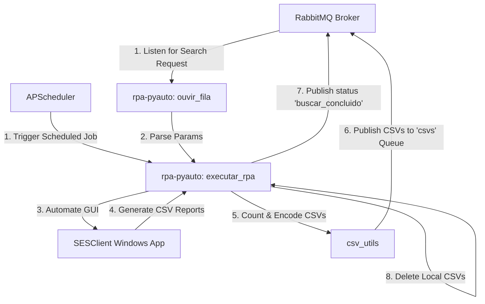

# SESClient Desktop RPA (Unicamp Lab Access)

An event-driven, scheduled Robotic Process Automation (RPA) tool developed in Python. It automates GUI interactions with the **SESClient** software to query and extract attendance/access control markings (students, employees, and third-party service providers), processing and streaming the data via **RabbitMQ**.

---

## 🚀 Overview

This RPA bot replaces manual report extraction by controlling the **SESClient** GUI on Windows, executing logins, performing searches for specific time ranges, and exporting the resulting data into CSV files. 

It works in two operation modes:
1. **Scheduled Mode:** Automatically triggers every 5 minutes using `APScheduler` to fetch the latest access markings.
2. **On-Demand (Event-Driven) Mode:** Listens to a RabbitMQ queue (`buscar`) for search parameters and executes a custom-range query instantly.

Once the data is extracted, the bot counts the records, base64-encodes the CSV files, streams them back to a RabbitMQ broker queue (`csvs`), and cleans up temporary local files.

---

## 🛠️ Architecture & Tech Stack



- **Python**: Core scripting and task orchestration.
- **PyAutoGUI**: GUI automation (keyboard shortcuts, text writing, mouse clicks, and image recognition).
- **Pika**: AMQP client to communicate with RabbitMQ.
- **APScheduler**: In-memory task scheduler for periodic runs.
- **OpenCV & Pillow**: High-precision image search (`locateCenterOnScreen` with confidence levels).
- **JSONL Logger**: Custom Python logger emitting structured, newline-delimited logs (`rpa.jsonl`) for seamless log analysis.

---

## 📁 Repository Structure

```
rpa-pyauto/
├── img/                  # PNG reference patterns for PyAutoGUI computer vision
├── buscar_registro.py    # RabbitMQ consumer setup listening to search queue
├── config.py             # Environment configurations, dotenv/secrets management
├── csv_utils.py          # CSV parsing, line counting, Base64 encoding, & uploading
├── desktop.py            # Main PyAutoGUI logic for SESClient GUI automation
├── install.bat           # Automated installer for dependencies (ODBC, SESClient, Python)
├── jsonFormatter.py      # Structured JSON formatting class for logging
├── main.py               # Main daemon orchestrating the scheduler & RabbitMQ consumer
├── publisher.py          # RabbitMQ producer for status and tracking messages
├── requirements.txt      # Python dependencies manifest
├── rpa.jsonl             # Local structured execution logs (JSONL format)
└── static.py             # App-level static variables and credentials
```

---

## ⚙️ Installation & Setup

### 1. Prerequisites (Silent Setup via Batch File)
Run the provided `install.bat` file **as Administrator** on Windows. This script automates the installation of:
* **SESClient Unicamp Desktop Client** (`SESClient_unicamp.exe`)
* **PostgreSQL ODBC Driver** (`psqlodbc-setup.exe`)
* **Python 3.13** (`python-3.13.7-amd64.exe`)

```bash
install.bat
```

### 2. Python Dependencies
Install the package requirements:
```bash
pip install -r requirements.txt
```

### 3. Image Vision Patterns
Ensure that reference images representing critical UI elements (e.g., login buttons, consulting/marking icons, error modals) are stored in the `./img/` folder with proper dimensions and matching the screen resolution:
* `usuarioSes.PNG`
* `consultarMarcacao.PNG`
* `iconeErro.PNG`
* `sair.png`

---

## 🚀 Execution

To start the RPA agent daemon (which runs both the 5-minute scheduler and the RabbitMQ queue consumer concurrently):

```bash
python main.py
```

### Queue Workflow Integrations:
- **Input queue:** `buscar` (durable)
  * Format: `{"data_inicio": "DDMMYYYY", "hora_inicio": "HHMM", "data_fim": "DDMMYYYY", "hora_fim": "HHMM"}`
- **Output data queue:** `csvs` (durable)
  * Format: `{"nome": "file_name.csv", "conteudo": "<Base64EncodedString>"}`
- **Output tracking queue:** `buscar_concluido` (durable)
  * Format: `{"status": "finalizado", "total_linhas": <number_of_rows_sent>}`

---

## 📝 Logging

The RPA generates structured logs in a `rpa.jsonl` file in the root directory. This makes it extremely easy to forward logs to ELK, Datadog, or Grafana Loki.

Example of a log entry:
```json
{"time": "2026-08-05 15:30:22", "level": "INFO", "message": "Login realizado com sucesso"}
{"time": "2026-08-05 15:30:45", "level": "INFO", "message": "Encontrados 3 arquivos CSV mais recentes"}
```
